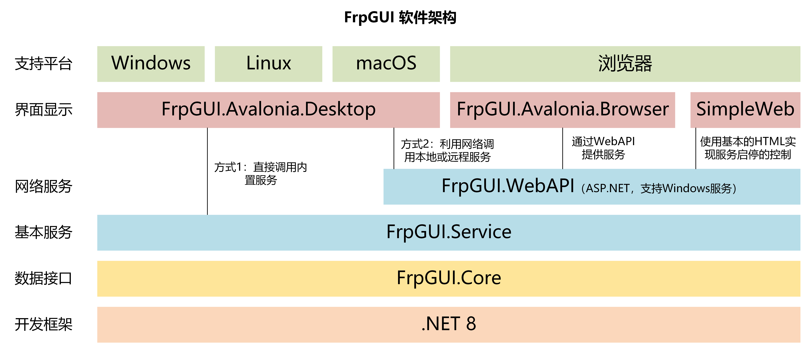
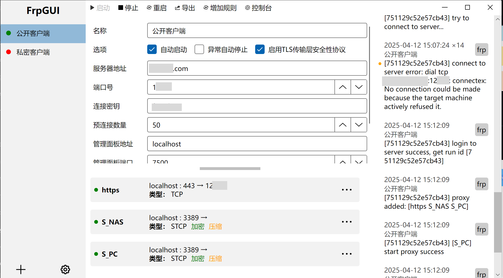
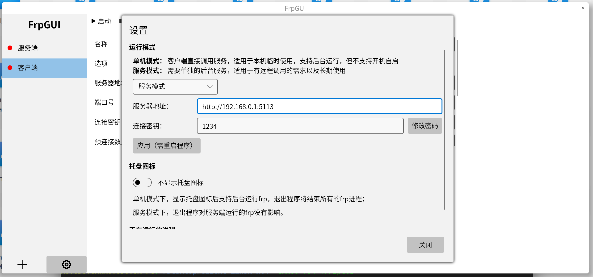
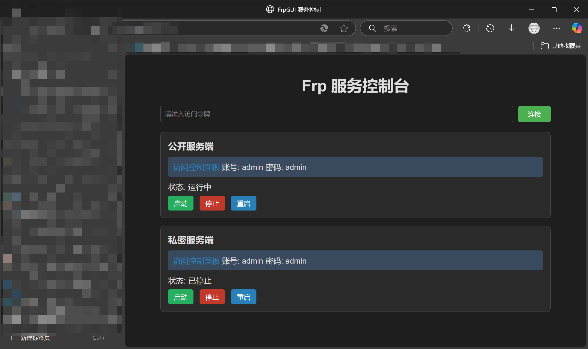

# FrpGUI

一个使用Avalonia开发的FRP（内网端口转发）的Windows/Linux/MacOS GUI程序



## 截图

### Windows-单机模式



### Linux-设置界面



### 浏览器-客户端配置界面



## 部署

### 下载

可在[Github的Release页](https://github.com/autodotua/FrpGUI/releases)下载最新版本的FrpGUI。共分为3种类型、4个平台：

- server：服务端，适用于长期运行frp服务的情景，或需要frp实现开机自启的情形。对外提供HTTP接口，实现远程控制
- client：客户端，可以独立控制frp服务，也可以连接到服务端对服务端进行配置和空值。
- browser：浏览器端，能够部署在Web服务器中，使使用者可以在任意地点使用任意设备进入FrpGUI的管理界面，对服务端进行管理。

### 客户端运行

客户端的运行比较方便，在Windows下执行`FrpGUI.exe`、在Linux和macOS下执行`FrpGUI`即可。

客户端包括两种运行模式：

- **单机模式：**客户端直接调用服务，适用于本机临时使用，支持后台运行，但不支持开机自启
- **服务模式：**需要有对应的服务端，适用于有远程调用的需求以及长期使用。

单机模式支持后台运行，可以在设置中打开托盘图标，当有frp进程在运行时，点击窗口的关闭按钮将隐藏到托盘图标，点击托盘图标显示主页面。彻底退出需要右键托盘图标进行退出。

### 服务端部署

#### 配置

配置服务端的配置文件位于`appsettings.json`。

- `Kestrel.Endpoints`：配置内置服务器的端口号等终结点。
- `ServerOnly`：配置是否仅允许创建frp服务器禁止使用frp客户端。frp客户端能够映射本地端口，因此具有一定的危险性。

#### 运行

服务端运行的实质是使用了Kestrel 作为Web服务器。Kestrel 是 [ASP.NET Core 的跨平台 Web 服务器](https://learn.microsoft.com/en-us/aspnet/core/fundamentals/servers/?view=aspnetcore-6.0)。Kestrel 是 ASP.NET Core 项目模板中默认包含和启用的 Web 服务器。即使在部署在Web服务器（如IIS）中，Web服务器也仅作为反向代理。

服务端的运行有多种办法：

- 直接运行

  服务端有一个入口`FrpGUI.WebAPI.exe`（Windows）或`FrpGUI.WebAPI`（Linux/macOS），可以直接双击运行或在命令行中执行。

- 托管到Web服务器

  服务端是一个标准的ASP.NET程序，可以使用[IIS](https://learn.microsoft.com/en-us/aspnet/core/host-and-deploy/iis/?view=aspnetcore-6.0)、[Nginx](https://learn.microsoft.com/en-us/aspnet/core/host-and-deploy/linux-nginx?view=aspnetcore-6.0)、[Apache](https://learn.microsoft.com/en-us/aspnet/core/host-and-deploy/linux-apache?view=aspnetcore-6.0)等Web服务器托管服务。使用Web服务器进行托管时，为了使FrpGUI能够控制由其启动的frp进程，应关闭Web服务器的回收功能。以IIS为例，在完成网站新建后，进入应用程序池，选中对应的网站，点击右侧“正在回收..”，取消勾选所有选择框后单击确定。此外，在IIS中托管，还应安装[Windows Hosting Bundle](https://dotnet.microsoft.com/en-us/download/dotnet/8.0)。

- 作为Windows服务

  服务端注册了Windows服务，允许作为Windows服务运行。作为Windows服务的优势是能够在系统用户登录前就开始运行，方便远程开机后进行远程桌面控制等操作。执行`CreateWindowsService.bat`脚本将注册为Windows服务，配置为开机自动启动，并立刻启动。执行`DeleteWindowsService`脚本将删除已注册的Windows服务。

### 浏览器端部署

浏览器端是一个Web Assembly程序，可以托管在Web服务器下，和正常的前端程序并无区别。部署完成后，建议编辑`uiconfig.json`中的`ServerAddress`，使其指向服务端的地址。该文件将作为浏览器端的默认配置，首次打开时，将读取该配置，因此设置`ServerAddress`能够减少用户的配置步骤。

注：浏览器端的wasm程序较大（可达50M），首次加载时，在较慢的网络环境中需要较长的时间。

## 开发

### 工作负载

应确保已安装以下SDK：

- [.NET 8 SDK](https://dotnet.microsoft.com/en-us/download/dotnet/8.0)

应确保已安装以下工作负载（可以使用`dotnet workload install <WORKLOAD_ID>`进行安装）：

- ASP.NET和Web开发
- Web Assembly工具（`wasm-tools`）

### 配置

- 配置`Directory.Build.props`
  - 将`FzLocal`改为`T`，以使用FzLib的Nuget包而不是本地构建版本
  - 若在Linux上开发，设置`Temp`为临时目录。

### 自动构建

1. 1. 下载frp二进制文件
   
   1. 在解决方案根目录创建`bin`目录
   1. 下载[frp](https://github.com/fatedier/frp/releases)的二进制文件（目前测试通过的是[v0.55.1](https://github.com/fatedier/frp/releases/tag/v0.55.1)，新版本理论也可使用），解压后放置到`bin`目录。此时，`bin`目录的结构如下（目录名中版本号任意）：

```
bin
│
├─frp_0.55.1_darwin_amd64
│      frpc
│      frpc.toml
│      frps
│      frps.toml
│      LICENSE
│
├─frp_0.55.1_linux_amd64
│      frpc
│      frpc.toml
│      frps
│      frps.toml
│      LICENSE
│
└─frp_0.55.1_windows_amd64
        frpc.exe
        frpc.toml
        frps.exe
        frps.toml
        LICENSE
```

3. 执行`build.ps1`PowerShell脚本。该脚本接收参数来选择具体需要生成的程序，具体可在Powershell中执行`Get-Help build.ps1 -Detailed`进行查看。

注：由于WebView.Avalonia库貌似不支持单文件构建，因此未使用`/p:PublishSingleFile=true`